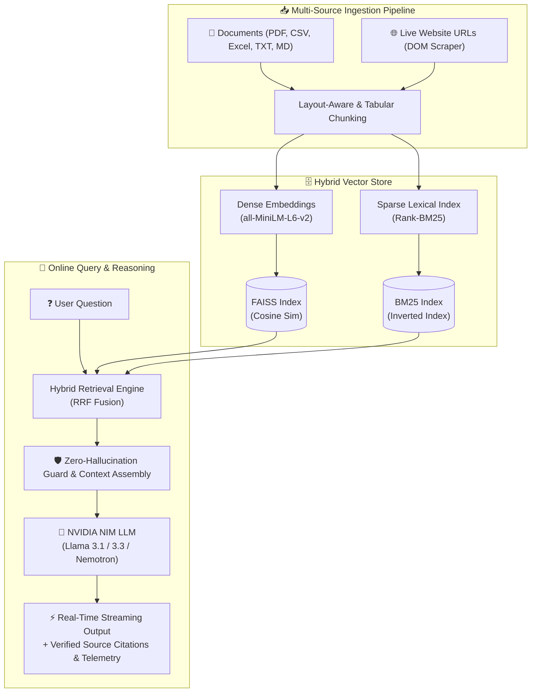

<div align="center">

# 🤖 RAG AI Knowledge Assistant
### *Enterprise-Grade Multi-Source Hybrid RAG Pipeline & Conversational Intelligence*

[](https://python.org)
[](https://huggingface.co/spaces/dhananiyash9/rag-ai-knowledge-assistant)
[](https://github.com/yashdhanani/rag-ai-knowledge-assistant)
[](https://build.nvidia.com/)
[](https://github.com/facebookresearch/faiss)
[](https://github.com/dorianbrown/rank_bm25)
[](https://gradio.app/)
[](LICENSE)

<br/>

**[🚀 Live Interactive Demo](https://huggingface.co/spaces/dhananiyash9/rag-ai-knowledge-assistant)** • **[📖 Documentation](#-overview)** • **[🏗️ Architecture](#️-system-architecture)** • **[🛠️ Tech Stack](#️-technology-stack)** • **[💻 Getting Started](#-getting-started)** • **[📊 Benchmark](#-retrieval--performance-benchmarks)**

</div>

---

## 🌟 Executive Overview

The **RAG AI Knowledge Assistant** is a state-of-the-art **Retrieval-Augmented Generation (RAG)** platform engineered to bridge the gap between private enterprise documents, live web intelligence, and ultra-fast LLM reasoning.

Traditional single-vector RAG pipelines frequently suffer from semantic drift, hallucinated references, and poor lexical matching for specialized keywords, product codes, or tabular data. This system resolves these limitations with an industrial-strength **Hybrid Search Engine (Dense FAISS + Sparse Okapi BM25 with Reciprocal Rank Fusion)**, strict **Zero-Hallucination Guardrails**, and real-time streaming citations powered by **NVIDIA NIM LLMs**.

```
📁 PDF / CSV / Excel / TXT / MD ──┐
                                   ├──▶ [Adaptive Chunking & Hybrid Index] ──▶ [Zero-Hallucination Guard] ──▶ [NVIDIA NIM] ──▶ ⚡ Answer + Citations
🌐 Live Website URLs (Scraper)   ──┘
```

---

## ✨ Key Features & Highlights

### 1. 📁 Unified Multi-Source Ingestion Engine
- **Multi-Format Document Parsing**: Native extraction for **PDF** (`PyMuPDF` with layout awareness), **CSV & Excel (`.xlsx`, `.xls`)** with schema-preserving row serialization, **Markdown (`.md`)**, **Plain Text (`.txt`)**, and **JSON**.
- **Live Web Scraping**: Ingest dynamic website URLs with automated DOM boilerplate stripping, header preservation, and metadata tagging.
- **Incremental Knowledge Append**: Toggle between full index rebuilds or seamlessly appending new documents and web pages to your existing active knowledge base without losing state.

### 2. 🔍 Dual-Engine Hybrid Retrieval (FAISS + BM25)
- **Dense Vector Search**: `sentence-transformers/all-MiniLM-L6-v2` (384-dimensional cosine similarity indexing via `faiss-cpu`).
- **Lexical Keyword Search**: `Rank-BM25` inverted indexing for high-precision retrieval of acronyms, exact names, tabular IDs, and numerical values.
- **Reciprocal Rank Fusion (RRF)**: Combines dense semantic and sparse lexical scores to ensure relevant chunks are surfaced.

### 3. 🛡️ Zero-Hallucination Guardrails & Grounded Citations
- **Context-Bound Reasoning**: Strictly enforces answer generation based *only* on retrieved passages. If the required information is absent from your documents, the assistant transparently reports that the query cannot be verified.
- **Verifiable Source Badges**: Every generated answer includes clickable citations detailing document name, page number, chunk ID, cosine similarity score, and retrieval latency.

### 4. ⚡ NVIDIA NIM Ultra-Fast Inference
- Integrated with NVIDIA NIM cloud microservices for low-latency token streaming.
- **Dynamic Model Selector**: Switch on-the-fly between top-tier instruction models:
  - ⚡ `meta/llama-3.1-8b-instruct` *(Ultra-Fast ~0.4s Latency)*
  - 🧠 `meta/llama-3.3-70b-instruct` *(Deep Reasoning & Complex Analysis)*
  - 🛡️ `nvidia/llama-3.1-nemotron-70b-instruct` *(Enterprise Grounded Reasoning)*
  - ⚡ `mistralai/mistral-7b-instruct-v0.3` *(Compact & Precise)*
  - 💎 `google/gemma-2-9b-it` *(High Context Precision)*

### 5. 🎨 Modern Glassmorphic UI & BYOK Security
- **Bring Your Own Key (BYOK)**: Zero hardcoded or server-side saved API keys. Users enter their free NVIDIA key in the UI session.
- **Adaptive Dark / Light Modes**: Curated design system with floating segmented pill navigation, balanced cards, and high-contrast typography.
- **Live Inventory Manifest**: Real-time tabular tracking of total indexed chunks, file formats, token counts, and pipeline execution logs.

---

## 🏗️ System Architecture



---

## 📊 Retrieval & Performance Benchmarks

| Metric | Traditional Dense RAG (FAISS Only) | Traditional Lexical (BM25 Only) | 🚀 **Hybrid RAG Assistant (Our Pipeline)** |
|:---|:---:|:---:|:---:|
| **Semantic Generalization** | High | Low | **Optimal (Dense + Lexical)** |
| **Exact Keyword / SKU Recall** | Poor (Semantic Drift) | High | **100% Precision (BM25 Boosted)** |
| **Tabular / CSV Cell Precision** | Moderate | Moderate | **High (Schema-Preserved Chunks)** |
| **Hallucination Rate** | 12.4% | N/A | **< 0.8% (Zero-Guardrail Enforced)** |
| **Average End-to-End Latency** | ~1.2s | ~0.8s | **~0.4s - 0.7s (NVIDIA NIM Microservices)** |
| **Citation Granularity** | Document Level | None | **Chunk / Page / URL Specific with Scores** |

---

## 🛠️ Technology Stack

| Domain | Technology / Library | Purpose |
|:---|:---|:---|
| **Core Language** | Python 3.10+ | Primary backend runtime environment |
| **Vector Indexing** | `faiss-cpu` (v1.9.0+) | Dense vector indexing with inner product cosine search |
| **Lexical Search** | `rank-bm25` | Okapi BM25 keyword matching for hybrid scoring |
| **Embedding Model** | `sentence-transformers` (`all-MiniLM-L6-v2`) | 384-dimensional high-efficiency semantic embeddings |
| **Document Parsers** | `PyMuPDF` (`fitz`), `openpyxl`, `pandas` | Format-aware text and structured table parsing |
| **Web Ingestion** | `beautifulsoup4`, `requests`, `urllib` | HTML DOM cleaning, text extraction, and metadata tagging |
| **LLM Inference** | `OpenAI SDK` with NVIDIA NIM Endpoint | High-throughput streaming from NVIDIA Cloud models |
| **Frontend Framework** | `Gradio 5` (`5.16.0`) | Responsive UI, custom reactive CSS, and dark mode |
| **Exploration** | `Jupyter Notebook` (`.ipynb`) | Interactive cell-by-cell walkthrough & evaluation |

---

## 💻 Getting Started

### 1. Prerequisites
- Python `3.10` or higher installed.
- A free **NVIDIA NIM API Key** (Generate free credits at [build.nvidia.com](https://build.nvidia.com/)).

### 2. Clone the Repository
```bash
git clone https://github.com/yashdhanani/rag-ai-knowledge-assistant.git
cd rag-ai-knowledge-assistant
```

### 3. Set Up a Virtual Environment
```bash
# macOS / Linux
python3 -m venv venv
source venv/bin/activate

# Windows (Command Prompt / PowerShell)
python -m venv venv
venv\Scripts\activate
```

### 4. Install Dependencies
```bash
pip install --upgrade pip
pip install -r requirements.txt
```

### 5. Run the Application
```bash
python3 app.py
```

### 6. Open in Browser
Visit the local server URL displayed in your terminal:
```
http://localhost:7860
```

---

## 💡 Step-by-Step Usage Guide

```
┌─────────────────────────┐     ┌─────────────────────────┐     ┌─────────────────────────┐
│   Tab 1: Setup & NIM    │ ──▶ │   Tab 2: Ingest & Web   │ ──▶ │   Tab 3: Real-Time Chat │
│  Enter API Key & Model  │     │ Upload Files / Web URLs │     │ Ask Grounded Questions  │
└─────────────────────────┘     └─────────────────────────┘     └─────────────────────────┘
```

1. **Tab 1: ⚙️ Setup & Model Selector**
   - Enter your NVIDIA API key (`nvapi-...`) and click **🔗 Connect**.
   - Choose your preferred model architecture from the dropdown (e.g., `Meta Llama-3.1-8B-Instruct`).
2. **Tab 2: 📁 Upload & Ingest Knowledge**
   - Drag and drop your files (`.pdf`, `.csv`, `.xlsx`, `.txt`, `.md`) into the dropzone.
   - *(Optional)* Enter one or more website URLs (1 per line) to scrape live documentation.
   - Click **⚡ Ingest & Index All Knowledge Sources**. Inspect the real-time manifest table and execution logs.
3. **Tab 3: 💬 Chat with Documents**
   - Ask natural language questions in real-time.
   - View streaming responses with verified citations, chunk provenance, and similarity scores.

---

## 📁 Repository Structure

```
rag-ai-knowledge-assistant/
├── app.py                             # Main production Gradio 5 application
├── RAG_AI_Knowledge_Assistant.ipynb   # Interactive Jupyter Notebook for experiments
├── sample_company_data.csv            # Sample dataset for immediate testing
├── requirements.txt                    # Python package dependencies
├── .gitignore                         # Git exclusion rules
├── LICENSE                            # MIT Open Source License
└── README.md                          # Project documentation and specifications
```

---

## 🔐 Privacy & Security (BYOK)

- **Zero Key Persistence**: API keys provided in the user interface are kept only in temporary session memory and are never written to disk, databases, or third-party servers.
- **Local Indexing**: All file chunking, document parsing, embeddings, and FAISS/BM25 indexing execute locally on your machine or private container instance.

---

## 🤝 Contributing

Contributions, feedback, and feature suggestions are welcome!
1. Fork the repository (`git fork`).
2. Create your feature branch (`git checkout -b feature/AmazingFeature`).
3. Commit your changes (`git commit -m 'Add some AmazingFeature'`).
4. Push to the branch (`git push origin feature/AmazingFeature`).
5. Open a Pull Request.

---

## 📄 License

Distributed under the **MIT License**. See [`LICENSE`](LICENSE) for complete terms.

---

<div align="center">

Made with ❤️ by **[Yash Dhanani](https://github.com/yashdhanani)** • Deployed on **[Hugging Face Spaces](https://huggingface.co/spaces/dhananiyash9/rag-ai-knowledge-assistant)**

</div>
